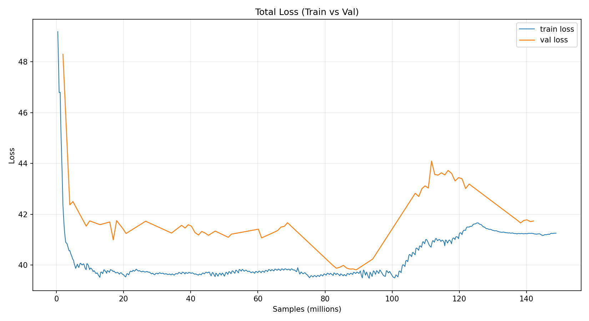
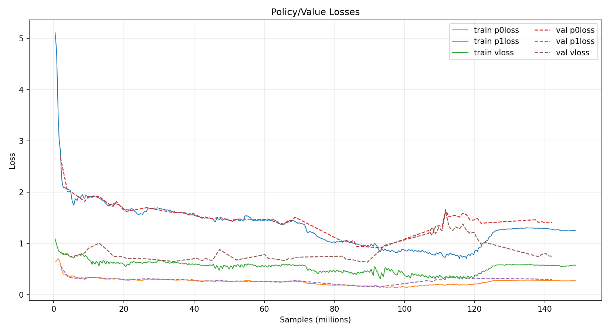
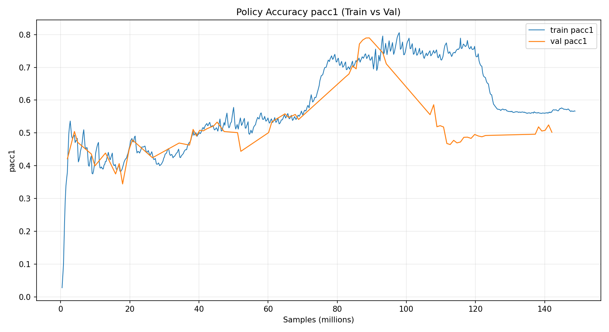

# 匈汉象棋（Xionghan）

一个基于 Go + Web 前端的人机对战棋类项目。

- 在线体验与规则说明：<https://xionghan.online/>
- 仓库地址：<https://github.com/H1W0XXX/xionghan>
- 人机模型训练基础：<https://github.com/hzyhhzy/KataGomo>

## 游戏规则

本项目的规则以线上版本为准，请直接查看：

- <https://xionghan.online/>

说明：

- 棋盘为 `13 x 13`。
- 当前实现以“吃掉对方王（皇）”作为胜负判定核心。
- 具体棋子走法与完整规则，请以上述网页说明为准。

## 本地运行

环境要求（最小）：

- Go `1.24+`
- ONNX Runtime 动态库（Windows 使用 `onnxruntime.dll 和 DirectML.dll`兜底）
- 模型文件（默认 `xionghan.onnx`）


启动后会自动打开浏览器到：`http://127.0.0.1:2888`

## AI 搜索深度调整

前端请求 AI 时的搜索深度在 `web/js/main.js` 中配置，当前默认：

```js
max_depth: 2
```

如果你有 TensorRT / CUDA 环境且显卡性能较强，可以尝试改为：

```js
max_depth: 4
```

说明：深度增大后，思考更强但耗时更高。

## 训练脚本与参数修改

模型训练基于 KataGomo 方案，项目内相关目录：

- `KataGomo/scripts/xionghan`

你可以在该目录下自行修改训练参数（如 `selfplay.cfg`、`run_train.sh` 及 `train/` 内脚本）。

## 训练日志图







## 许可协议

本项目可免费用于学习、研究及非商业用途，使用时请注明仓库链接及作者信息。  
严禁任何形式的商业使用（包括二次打包、付费分发或内嵌收费服务等）。

本项目采用：`CC BY-NC 4.0`（署名-非商业性使用）。

同时请遵守第三方依赖项目（如 KataGomo）各自原始许可证要求。